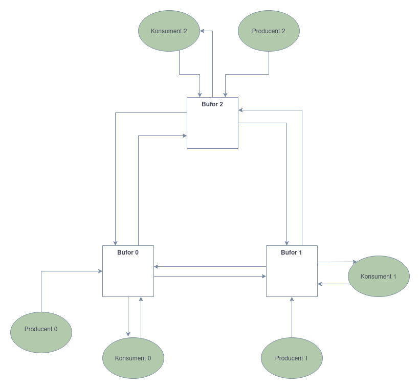

# Rozproszyny bufor zrealizowany w oparciu o JCSP
## Autor: Michał Stefanik

# Model

Rys 1. Diagram przedstawiający połączenia między agentami w modelu.

Model działania powyższego bufora działa tak, że mamy n buforów, n producentów i n konsumentów. Każdy z producentów
wysyła wiadomość do bufora, a każdy z konsumentów najpierw wysyła wiadomość o gotowości do odebrania,
po czym odbiera wiadomość z bufora. Każdy z buforów posiada swoją tablicę wiadomości, z której przesyła wiadomości do konsumenta
jeśli ten jest gotowy. Jeśli konsument nie jest gotowy, a bufor ma w posiadaniu token, to bufor wysyła wiadomość do następnego bufora.
Jeśli bufor nie ma w posiadaniu tokena, to bufor pozostawia wiadomość w swojej tablicy i czeka na token lub na wiadomość o gotowości
od konsumenta. Można by powiedzieć, że bufor jest zrealizowany w oparciu o algorytm token ring. Jeśli byśmy porzucili token,
można by uznać ten model, za problem jednego producenta i jednego konsumenta, gdzie producent wysyła wiadomość do bufora,
a konsument najpierw wysyła wiadomość o gotowości, po czym odbiera wiadomość z bufora. Dodanie tokenu pozwala na przesyłanie
wiadomości między buforami, co pozwala na równoważenie obciążenia buforów. Model ten można uogólnić do n producentów i
n konsumentów dla każdego bufora. 

Przesyłanie wiadomości między buforami jest zrealizowane przez podanie tokena do następnego bufora. Token jest przesyłany
w kierunku zgodnym z ruchem wskazówek zegara. Jeśli bufor A ma w posiadaniu token, to bufor A wysyła wiadomość do bufora B.
Wiadomość ta zawiera informację o tym, czy bufor A chce przesłać element do bufora B. Jeśli bufor B nie jest gotowy na przyjęcie,
to odsyła do bufora A stosowny komunikat i bufor A nie przesyła mu elementu. Chęć przesłania elementu jest zależna od stopnia
zapełnienia bufora A, a chęć odebrania elementu jest zależna od stopnia zapełnienia bufora B. W moim rozwiązaniu, jeśli bufor A
ma co najmniej 60% elementów, to będzie chciał wysłać element do bufora B. Jeśli bufor B będzie miał poniżej 40% elementów,
to będzie chciał odebrać element od bufora A. Jeśli oba z tych warunków są spełnione, to bufor A wysyła element do bufora B.
W przeciwnym wypadku bufor A nie wysyła elementu do bufora B. Inne wartości niż 50% zostały wybrane w celu zmniejszenia szans
na ciągłe przesyłanie elementów między buforami. Tokeny razem z elementami mogą być przesyłane między buforami tylko zgodnie
z ruchem wskazówek zegara.

# Wyniki

W każdym z modeli wyniki powstały w przez tworzenie rozkładów zajętości buforów co 1 milisekundę. Rozkłady były akumulowane
przez 10 sekund. Jako ostateczne wyniki pokazane zostały średnie i odchylenia standardowe z tych rozkładów. Maksymalna liczba
elementów w buforze wynosiła 100.

## Model bez krążenia tokena
| Średnia | Odchylenie standardowe |
|---------|--------------------|
| 43.0    | 43.278170016764804 |
 | 37.0    | 44.05678154382138  |
 | 33.0    | 42.8485705712571   |
 | 33.0    | 41.340053217188775 |
 | 38.0    | 42.906875905849866 |
## Model z krążeniem tokena
| Średnia | Odchylenie standardowe |
|---------|------------------------|
| 62.0 | 35.11409973215888      |
| 39.0 | 36.02776706930364      |
| 40.0 | 36.932370625238775     |
| 40.0 | 38.06573262134856      |
| 48.0 | 38.7556447501522       |

Najlepszy model powinien się charakteryzować najniższą średnią i najniższym odchyleniem standardowym. Widać, że model z krążeniem
tokena jest lepszy od modelu bez krążenia tokena ze względu na mniejsze odchylenie standardowe. Oznacza to, że wypełnienie bufora w czasie
oscylowało bliżej średniej. W modelu bez krążenia tokena odchylenia standardowe były wyższe, ale średnie były niższe. Mogło się tak stać, gdyż część
zasobów systemowych została zużyta na przesyłanie wiadomości między buforami: tokenów i elementów. W tym przypadku trudno powiedzieć, który model
jest lepszy.