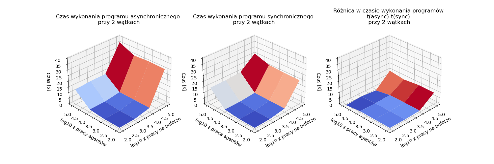
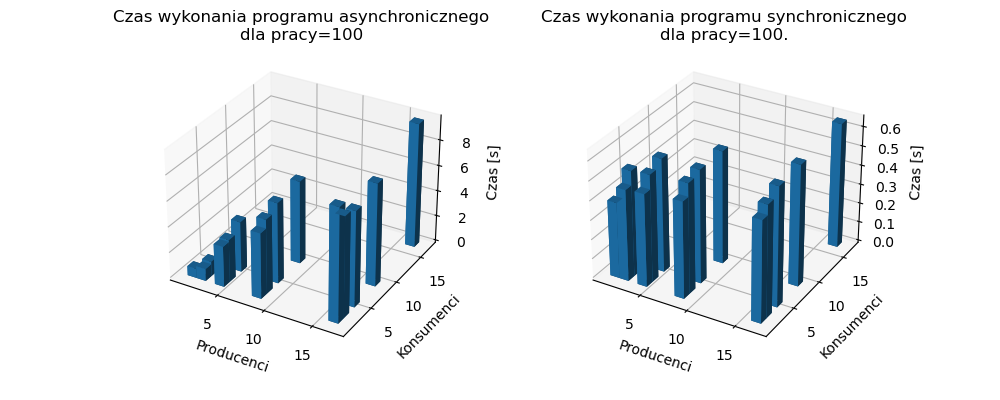
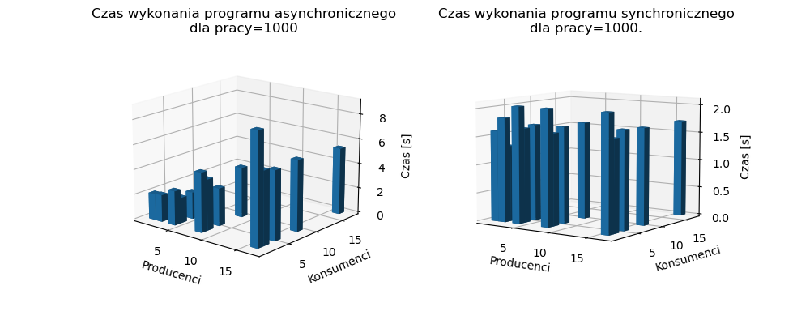

# Badanie wydajności problemu producentów i konsumentów w podejściu synchronicznym i asynchronicznym.
## Autor: Michał Stefanik
## Cel
Badanie miało na celu porównanie sprawności działania dwóch podejść do problemu producentów i konsumentów. Pierwsze z nich to synchroniczny bufor korzystający z podwójnych blokad. Drugie jest oparte na wzorcu projektowym ActiveObject. Dodatkowe parametry rozpatrywane w badaniu to:
* liczba producentów
* liczba konsumentów
* ilość wykonanej pracy pomiędzy kolejnymi akcjami agentów tj. produkcją lub konsumpcją

## Metoda badania
Eksperyment polegał na mierzeniu wybranych metryk przy wybraniu określonej liczby producentów, liczby konsumentów, ilości wykonanej pracy.
### Pseudokody agentów (producentów, konsumentów)
W przypadkach asynchronicznych została dołożona dodatkowa zmienna $workCounter$ określająca ilość pracy wykonanej pomiędzy sprawdzeniem dostępności wyniku dostępu do bufora. W przypadkach synchronicznych wartość ta zawsze wynosi 1.
* synchroniczny producent:
```java
while (true) {
    listToPut = randomList(bound); // lista losowych wartości o długości <1, bound>
    syncBuffer.put(listToPut); // blokujące wstawienie elementów z listy do bufora
    doWork(amount); // wykonanie n razy pewnej pracy
}
```
* synchroniczny konsument
```java
while (true) {
    n = random(bound); // losowanie liczby z przedziału <1, bound>
    syncBuffer.get(n); // blokujące pobranie n elementów z bufora
    doWork(amount); // wykonanie n razy pewnej pracy
}
```
* asynchroniczny producent
```java
while (true) {
    listToPut = randomList(bound); // lista losowych wartości o długości <1, bound>
    futureList = asyncBuffer.put(listToPut); // zlecenie wstawienia n elementów do bufora ze zwrotem obiektu typu future
    workCounter = 0; // licznik wykonanej pracy
    while (futureList.isNotReady()) {
        doWork(amount); // wykonanie n razy pewnej pracy
        workCounter++;
    }
    doneWork.append(workCounter); // dopisanie do zewnętrznej listy liczby powtórzeń pętli
}
```
* asynchroniczny konsument
```java
while (true) {
    n = random(bound); // losowanie liczby z przedziału <1, bound>
    futureList = asyncBuffer.get(n); // zlecenie pobrania n elementów z bufora ze zwrotem obiektu typu future
    workCounter = 0; // licznik wykonanej pracy
    while (futureList.isNotReady()) {
        doWork(amount); // wykonanie n razy pewnej pracy
        workCounter++;
    }
    newList = futureList.getValue()
    doneWork.append(workCounter); // dopisanie do zewnętrznej listy liczby powtórzeń pętli
}
```

### Metryki
1. Rzeczywisty czas potrzebny na pobranie co najmniej 500000 elementów z bufora
2. Średnia ze średniej pracy producentów wykonanej pomiędzy dostępami do bufora (średnia średnich workDone) w czasie działania programu.
3. Średnia ze średniej pracy konsumentów wykonanej pomiędzy dostępami do bufora (średnia średnich workDone) w czasie działania programu

Wszystkie te metryki są liczone na raz, więc przez czas działania programu rozumiemy czas po którym bufor obsłuży co najmniej 500000 elementów.

W uproszczeniu: dla każdego producenta mamy listę liczników (doneWork). Dla każdego producenta liczymy średnią pracę. Na koniec liczymy średnią pracę wszystkich producentów (średnią z tych średnich). Analogicznie dla konsumentów.

<div style="page-break-after: always;"></div>

## Badane parametry
* Liczba producentów: 1, 2, 4, 8, 16
* Liczba konsumentów: 1, 2, 4, 8, 16
* Liczba wykonanej pracy $amount$: 10, 100, 1000

## Wyniki

Rysunek 1. Porównanie czasów wykonania dla pracy=10

Rysunek 2. Porównanie czasów wykonania dla pracy=100

Rysunek 3. Porównanie czasów wykonania dla pracy=1000

## Wnioski
* W przypadku asynchronicznym liczba wątków (producentów i konsumentów) ma spory wpływ na czas wykonanie $x$ operacji. W większości przypadków im więcej wątków tym dłuższy czas obsługi. Dla przypadku synchronicznego ta liczba nie miała większego znaczenia.
* Rozmiar wykonanej pracy w przypadku synchronicznym sprawiał, że czas wykonania zadania wzrastał. W przypadku asynchronicznym wraz jeśli było mało wątków i to szybsza była wersja z małą ilością pracy, natomiast w przypadku wielu, szybsza okazywała się wersja z dużą ilością pracy. Może być to spowodowane przez mniej dostępów do współdzielonej kolejki blokującej.

