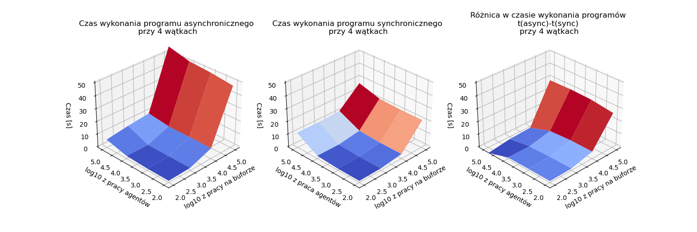

# Badanie wydajności problemu producentów i konsumentów w podejściu synchronicznym i asynchronicznym.
## Autor: Michał Stefanik
## Cel
Badanie miało na celu porównanie sprawności działania dwóch podejść do problemu producentów i konsumentów. Pierwsze z nich to synchroniczny bufor korzystający z podwójnych blokad. Drugie jest oparte na wzorcu projektowym ActiveObject. Dodatkowe parametry rozpatrywane w badaniu to:
* liczba producentów
* liczba konsumentów
* ilość wykonywanej pracy pomiędzy kolejnymi akcjami agentów tj. produkcją lub konsumpcją
* ilość wykonywanej pracy przy obsłużenia bufora

W dalszej części jeśli będzie mowa o "agentach", będzie chodziło o producentów lub konsumentów.

## Sprzęt
* System operacyjny: Ubuntu 22.10 x86_64
* Procesor: Intel i7-7500U (4) @ 3.500GHz 2-rdzeniowy 4-wątkowy
* Pamięć: 8GB

## Opis implementacji buforów
### Wzorzec Active Object
Podstawowym obiektem w podejściu asynchronicznym jest Scheduler. Posiada on takie dane jak:
* Synchroniczna zewnętrzna kolejka
* Kolejka wewnętrzna

W tych kolejkach przechowuje obiekty funkcji, których wywołanie zlecili agenci. Cykl działania Schedulera jest następujący:
1. Sprawdź czy są zadania w kolejce wewnętrznej.
2. Sprawdź czy się da wykonać pierwsze z nich.
3. Jeśli się da wykonać to zdejmij je z kolejki, wykonaj i przejdź do kroku 1. Jeśli nie da się wykonać to przejdź do punktu 4.
4. Sprawdź czy jest zadanie w kolejce zewnętrznej
5. Jeśli jest to sprawdź czy się da wykonać, w przeciwnim wypadku idź do 7.
6. Jeśli się da wykonać to wyjmij je z kolejki, wykonaj i przejdź do punktu 4. Jeśli nie, to wyjmij je z kolejki zewnętrznej, je do kolejki wewnętrznej. Przejdź do kroku 4.
7. Czekaj na zadanie w kolejce zewnętrznej. Jeśli się pojawi to zrób kroki analogiczne do kroków 4-6 i przejdź do kroku 1.

W uproszczeniu jeśli da się wykonać zadania z którejkolwiek koleki, scheduler je wykonuje. Jeśli zadania wciąż nie da się wykonać, to scheduler zostawia je w kolejce wewnętrznej (nie rusza, bądź wstawia na koniec jeśli była z kolejki zewnętrznej).

Agenci mają dostęp do bufora, ale tylko na potrzebę tworzenia opakowanych metod z dostępem do bufora. Po wykonaniu metody zlecenia na Schedulerze (scheduler.request()). W efekcie wywołania tej metody na zewnętrznej kolejce schedulera zostaje umieszczone zleceniu wykonania metody, a agent dostaje obiekt typu Future. Obiekt ten zostanie odpowiednio zmodyfikowany podczas wywołania metody przez Scheduler.

### Opis metody synchronicznej
Każdy agent ma bezpośredni dostęp do bufora przez synchroniczne funkcje putList() oraz getList(). Bufor posiada 3 zmienne typu Lock:
* producerLock
* consumerLock
* internalLock

oraz dwie zmienne warunkowe na zmiennej internalLock. Dzięki takiemu rozwiązaniu nie zachwujemy co prawda kolejności wykonania, ale zapobiegamy zagłodzeniu, gdyż każy agent po wejściu do pierwszego locka, będzie czekał na wejście do drugiego aż do skutku. W tym czasie będzie agenci z przeciwnej kolejki będą się wywoływać aż agent z pierwotnej kolejki będzie się mógł wykonać. Poniżej przedstawione 

```java
public void putList(List<Integer> list) throws InterruptedException {
        producerLock.lock();
        internalLock.lock();

        while (capacity - stored < list.size()) {
            producerCondition.await();
        }

        for (Integer value : list) {
            buffer[stored] = value;
            stored++;
        }
        Utils.work(work);
        consumerCondition.signal();
        internalLock.unlock();
        producerLock.unlock();
    }
```
<div style="text-align: center;">
Pseudokod 1. Implementacja metody putList na synchronicznym buforze.
</div>
<div style="page-break-after: always;"></div>

```java
public List<Integer> getList(int n) throws InterruptedException {
        consumerLock.lock();
        internalLock.lock();

        while (stored < n) {
                consumerCondition.await();
        }

        List<Integer> list = new ArrayList<>();
        for (int i = 0; i < n; i++) {
            stored--;
            totalGet++;
            list.add(buffer[stored]);
        }
        Utils.work(work);
        producerCondition.signal();
        internalLock.unlock();
        consumerLock.unlock();

        return list;
    }
```
<div style="text-align: center;">
Pseudokod 2. Implementacja metody getList na synchronicznym buforze.
</div>

## Metoda badania
Eksperyment polegał na mierzeniu czasu wykonania programu przy wybraniu określonej liczby producentów, liczby konsumentów, ilości wykonywanej pracy przez agentów oraz ilosci wykonywanej pracy przez bufor.
### Pseudokody agentów (producentów, konsumentów)
```java
while (true) {
    listToPut = randomList(bound); // lista losowych wartości o długości <1, bound>
    syncBuffer.put(listToPut); // blokujące wstawienie elementów z listy do bufora
    doWork(amount); // wykonanie n razy pewnej pracy
}
```
<div style="text-align: center;">
Pseudokod 3. Uproszczone działanie synchronicznych agentów.
</div>
<div style="page-break-after: always;"></div>

```java
while (true) {
    n = random(bound); // losowanie liczby z przedziału <1, bound>
    syncBuffer.get(n); // blokujące pobranie n elementów z bufora
    doWork(amount); // wykonanie n razy pewnej pracy
}
```
<div style="text-align: center;">
Pseudokod 4. Uproszczone działanie synchronicznego konsumenta
</div>

```java
while (true) {
    listToPut = randomList(bound); // lista losowych wartości o długości <1, bound>
    futureList = asyncBuffer.put(listToPut); // zlecenie wstawienia n elementów do bufora ze zwrotem obiektu typu future
    workCounter = 0; // licznik wykonanej pracy
    while (futureList.isNotReady()) {
        doWork(amount); // wykonanie n razy pewnej pracy
        workCounter++;
    }
}
```
<div style="text-align: center;">
Pseudokod 5. Uproszczone działanie asynchronicznego producenta.
</div>


```java
while (true) {
    n = random(bound); // losowanie liczby z przedziału <1, bound>
    futureList = asyncBuffer.get(n); // zlecenie pobrania n elementów z bufora ze zwrotem obiektu typu future
    workCounter = 0; // licznik wykonanej pracy
    while (futureList.isNotReady()) {
        doWork(amount); // wykonanie n razy pewnej pracy
        workCounter++;
    }
    newList = futureList.getValue()
}
```
<div style="text-align: center;">
Pseudokod 6. Uproszczone działanie asynchronicznego konsumenta.
</div>

### Dodatkowa praca
Obiekty buforów oprócz operacji takich jak wstawienie oraz pobranie x elementów bezpośrednio do struktury danych, wykonują pewną pracę. Działa to w taki sposób, że po wykonaniu akcji (wstawienia lub pobrania) wykonują zadaną liczbę obliczania sinusów. Identyczną pracę, w odpowiedniej liczbie powtórzeń) wykonują agenci w swojej części pracy.

<div style="page-break-after: always;"></div>

### Metryki
1. Rzeczywisty czas potrzebny na pobranie na co najmniej 50000 elementów z bufora.
2. Średnia ze średniej pracy producentów wykonanej pomiędzy dostępami do bufora (średnia średnich workDone) w czasie działania programu.
3. Średnia ze średniej pracy konsumentów wykonanej pomiędzy dostępami do bufora (średnia średnich workDone) w czasie działania programu

Wszystkie te metryki są liczone na raz, więc przez czas działania programu rozumiemy czas po którym bufor obsłuży co najmniej 500000 elementów.

W uproszczeniu: dla każdego producenta mamy listę liczników (doneWork). Dla każdego producenta liczymy średnią pracę. Na koniec liczymy średnią pracę wszystkich producentów (średnią z tych średnich). Analogicznie dla konsumentów.

Ostatecznie w sprawozdaniu została zamieszczona tylko pierwsza, gdyż najwięcej wnosi. Druga i trzecia miały znaczenie pomocnicze przy dobieraniu sensownych parametrów prac.


## Badane parametry
* Sumaryczna liczba producentów i konsumentów: 2, 4, 8
* Liczba wykonanej pracy przez agentów: 100, 1000, 10000, 100000
* Liczba wykonanej pracy przez bufor: 100 1000 10000 100000

Liczba producentów jest zawsze równa liczbie konsumentów.

## Wyniki
Na wykresach poniżej widzimy czas wykonania się programu w wersji asynchronicznej (po lewej), w wersji synchronicznej (środek), oraz różnice tych czasów (po prawej) w zalezności od sumarycznej liczby wątków oraz zadanych prac.
<div style="text-align: center;">


Rysunek 1. Porównanie synchronicznej i asynchronicznej wersji programu przy 2 wątkach agentów.



Rysunek 2. Porównanie synchronicznej i asynchronicznej wersji programu przy 4 wątkach agentów.


Rysunek 3. Porównanie synchronicznej i asynchronicznej wersji programu przy 8 wątkach agentów.

</div>

## Wnioski
* Na podstawie Rysunku 1, 2 oraz dwóch pierwszych wkresów można wskazać, że wzrost pracy na buforze lub wzrost pracy agentów powodował wydłużenie czasu trwania programu.
* W przypadku gdy trzeba wykonać dużo więcej pracy na wielu agentach w porównaniu do pracy na buforze (Rys 3., prawy wykres), podejście asynchroniczne okazuje się lepsze.
* W zależności od specyfiki problemu jedno z tych podejść może okazać się lepsze i dobrze sprawdzić je oba.