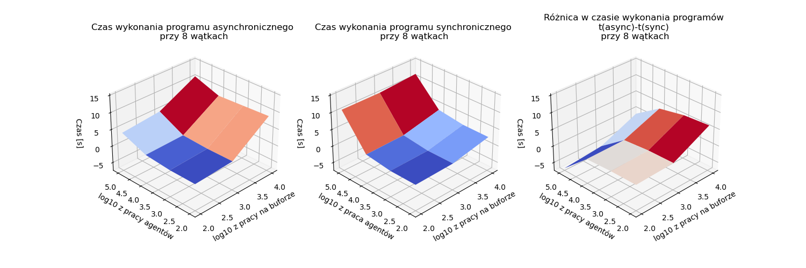

# Badanie wydajności problemu producentów i konsumentów w podejściu synchronicznym i asynchronicznym.
## Autor: Michał Stefanik
## Cel
Badanie miało na celu porównanie sprawności działania dwóch podejść do problemu producentów i konsumentów. Pierwsze z nich to synchroniczny bufor korzystający z podwójnych blokad. Drugie jest oparte na wzorcu projektowym ActiveObject. Dodatkowe parametry rozpatrywane w badaniu to:
* liczba producentów
* liczba konsumentów
* ilość wykonywanej pracy pomiędzy kolejnymi akcjami agentów tj. produkcją lub konsumpcją
* ilość wykonywanej pracy przy obsłużenia bufora

## Sprzęt
* System operacyjny: Ubuntu 22.10 x86_64
* Procesor: Intel i7-7500U (4) @ 3.500GHz 2-rdzeniowy 4-wątkowy
* Pamięć: 8GB

## Metoda badania
Eksperyment polegał na mierzeniu czasu wykonania programu przy wybraniu określonej liczby producentów, liczby konsumentów, ilości wykonywanej pracy przez agentów oraz ilosci wykonywanej pracy przez bufor.
### Pseudokody agentów (producentów, konsumentów)
* synchroniczny producent:
```java
while (true) {
    listToPut = randomList(bound); // lista losowych wartości o długości <1, bound>
    syncBuffer.put(listToPut); // blokujące wstawienie elementów z listy do bufora
    doWork(amount); // wykonanie n razy pewnej pracy
}
```
* synchroniczny konsument
```java
while (true) {
    n = random(bound); // losowanie liczby z przedziału <1, bound>
    syncBuffer.get(n); // blokujące pobranie n elementów z bufora
    doWork(amount); // wykonanie n razy pewnej pracy
}
```
* asynchroniczny producent
```java
while (true) {
    listToPut = randomList(bound); // lista losowych wartości o długości <1, bound>
    futureList = asyncBuffer.put(listToPut); // zlecenie wstawienia n elementów do bufora ze zwrotem obiektu typu future
    workCounter = 0; // licznik wykonanej pracy
    while (futureList.isNotReady()) {
        doWork(amount); // wykonanie n razy pewnej pracy
        workCounter++;
    }
}
```
* asynchroniczny konsument
```java
while (true) {
    n = random(bound); // losowanie liczby z przedziału <1, bound>
    futureList = asyncBuffer.get(n); // zlecenie pobrania n elementów z bufora ze zwrotem obiektu typu future
    workCounter = 0; // licznik wykonanej pracy
    while (futureList.isNotReady()) {
        doWork(amount); // wykonanie n razy pewnej pracy
        workCounter++;
    }
    newList = futureList.getValue()
}
```
### Dodatkowa praca
Obiekty buforów oprócz operacji takich jak wstawienie oraz pobranie x elementów bezpośrednio do struktury danych, wykonują pewną pracę. Działa to w taki sposób, że po wykonaniu akcji (wstawienia lub pobrania) wykonują zadaną liczbę obliczania sinusów. Identyczną pracę, w odpowiedniej liczbie powtórzeń) wykonują agenci w swojej części pracy. 

### Metryki
1. Rzeczywisty czas potrzebny na pobranie na co najmniej 50000 elementów z bufora.
2. Średnia ze średniej pracy producentów wykonanej pomiędzy dostępami do bufora (średnia średnich workDone) w czasie działania programu.
3. Średnia ze średniej pracy konsumentów wykonanej pomiędzy dostępami do bufora (średnia średnich workDone) w czasie działania programu

Wszystkie te metryki są liczone na raz, więc przez czas działania programu rozumiemy czas po którym bufor obsłuży co najmniej 500000 elementów.

W uproszczeniu: dla każdego producenta mamy listę liczników (doneWork). Dla każdego producenta liczymy średnią pracę. Na koniec liczymy średnią pracę wszystkich producentów (średnią z tych średnich). Analogicznie dla konsumentów.

Ostatecznie w sprawozdaniu została zamieszczona tylko pierwsza, gdyż najwięcej wnosi. Druga i trzecia miały znaczenie pomocnicze przy dobieraniu sensownych parametrów prac.

<div style="page-break-after: always;"></div>

## Badane parametry
* Sumaryczna liczba producentów i konsumentów: 2, 4, 8
* Liczba wykonanej pracy przez agentów: 100, 1000, 10000, 100000
* Liczba wykonanej pracy przez bufor: 100 1000 10000 100000

Liczba producentów jest zawsze równa liczbie konsumentów.

## Wyniki
Na wykresach poniżej widzimy czas wykonania się programu w wersji asynchronicznej (po lewej), w wersji synchronicznej (środek), oraz różnice tych czasów (po prawej) w zalezności od sumarycznej liczby wątków oraz zadanych prac.
<div style="text-align: center;">


Rysunek 1. Porównanie synchronicznej i asynchronicznej wersji programu przy 2 wątkach agentów.


Rysunek 2. Porównanie synchronicznej i asynchronicznej wersji programu przy 4 wątkach agentów.



Rysunek 3. Porównanie synchronicznej i asynchronicznej wersji programu przy 8 wątkach agentów.

</div>

## Wnioski
* W każdym przypadku wzrost pracy na buforze lub wzrost pracy agentów powodował wydłużenie czasu trwania programu.
* W przypadku gdy trzeba wykonać dużo więcej pracy na wielu agentach w porównaniu do pracy na buforze, podejście asynchroniczne okazuje się lepsze (Rys. 3, prawy wykres). Zaś w pozostałych przypadkach podejście synchroniczne dało krótszy czas wykonania.